 <h1 align="center">  Hi there 👋 </h1>

 <h2 align="center"> My name is Botakoz. I'm QA automation engineer.</h2>

  I have successfully comleted the course in QA Automation school [QA.GURU](https://qa.guru). Here you can see my certifications in Rushian and English languages.
 
 

In addition I attach my graduation work for UI, REST, mobile projects. The technology stack is as follows:

  <code>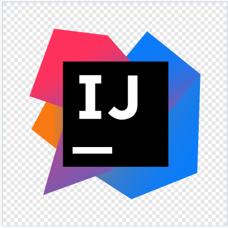</code>
  <code></code>
  <code>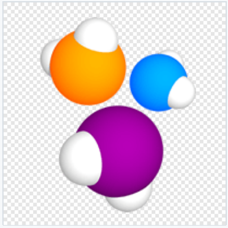</code>
  <code>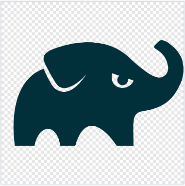</code>
  <code>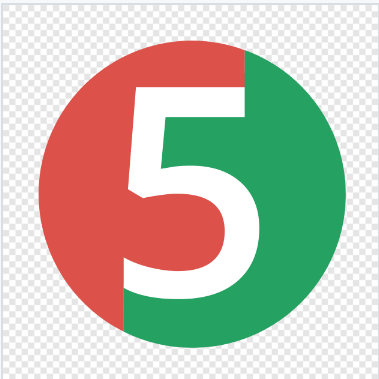</code>
  <code>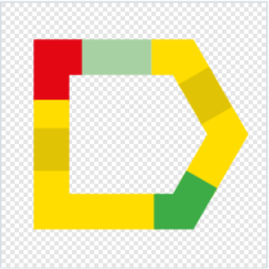</code>
  <code></code>
  <code>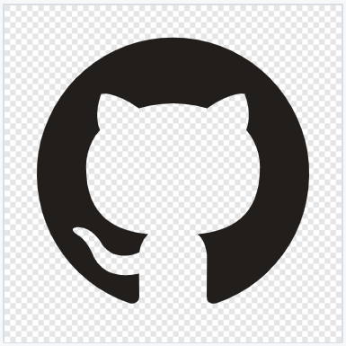</code>
  <code>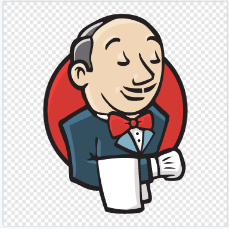</code>
  <code></code>
  <code></code>
  <code>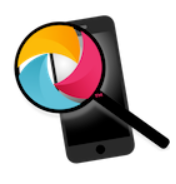</code>
  <code>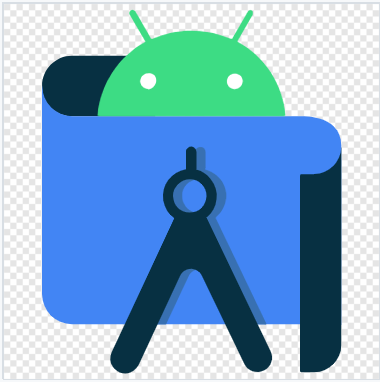</code>
  <code>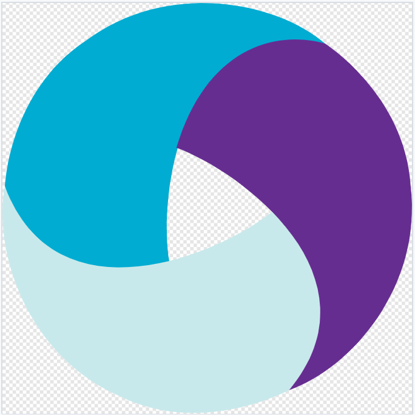</code>
   <code></code>
  <code>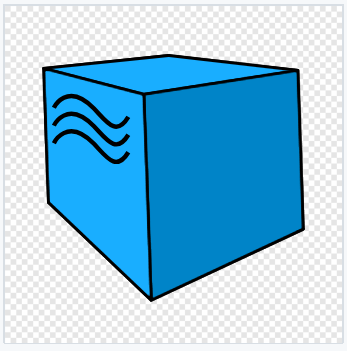</code>

<!--
**utebaliyevabotakoz/utebaliyevabotakoz** is a ✨ _special_ ✨ repository because its `README.md` (this file) appears on your GitHub profile.

Here are some ideas to get you started:

- 🔭 I’m currently working on ...
- 🌱 I’m currently learning ...
- 👯 I’m looking to collaborate on ...
- 🤔 I’m looking for help with ...
- 💬 Ask me about ...
- 📫 How to reach me: ...
- 😄 Pronouns: ...
- ⚡ Fun fact: ...
-->
